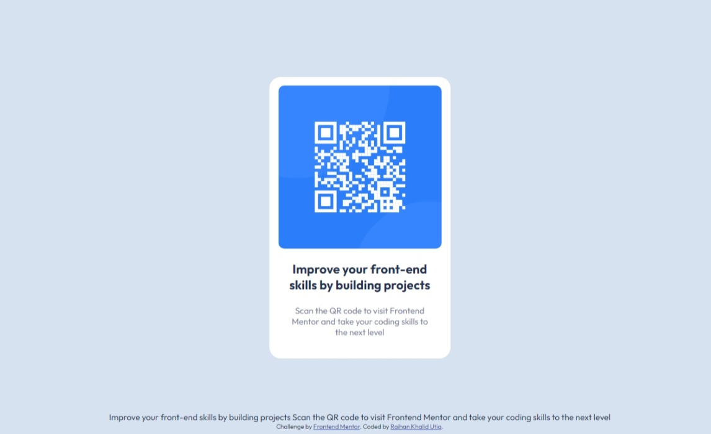

# Frontend Mentor - QR code component solution

This is a solution to the [QR code component challenge on Frontend Mentor](https://www.frontendmentor.io/challenges/qr-code-component-iux_sIO_H). Frontend Mentor challenges help you improve your coding skills by building realistic projects. 

## Table of contents

- [Frontend Mentor - QR code component solution](#frontend-mentor---qr-code-component-solution)
  - [Table of contents](#table-of-contents)
  - [Overview](#overview)
    - [Screenshot](#screenshot)
    - [Links](#links)
  - [My process](#my-process)
    - [Built with](#built-with)
  - [Author](#author)

## Overview

### Screenshot

### Links

- Solution URL: [Solution](https://www.frontendmentor.io/solutions/qr-code-component-using-css-flexbox-plS0unno_A)
- Live Site URL: [Live Site](https://raihanutia.github.io/qrCodeComp/)

## My process

### Built with

- Semantic HTML5 markup
- Flexbox

## Author

- LinkedIn - [Raihan K. Utia](https://www.linkedin.com/in/raihankhalidutia/)
- Frontend Mentor - [@raihanutia](https://www.frontendmentor.io/profile/raihanutia)
- Discord - [@rutiaaa_](https://www.discord.com/users/424572827409055764)

